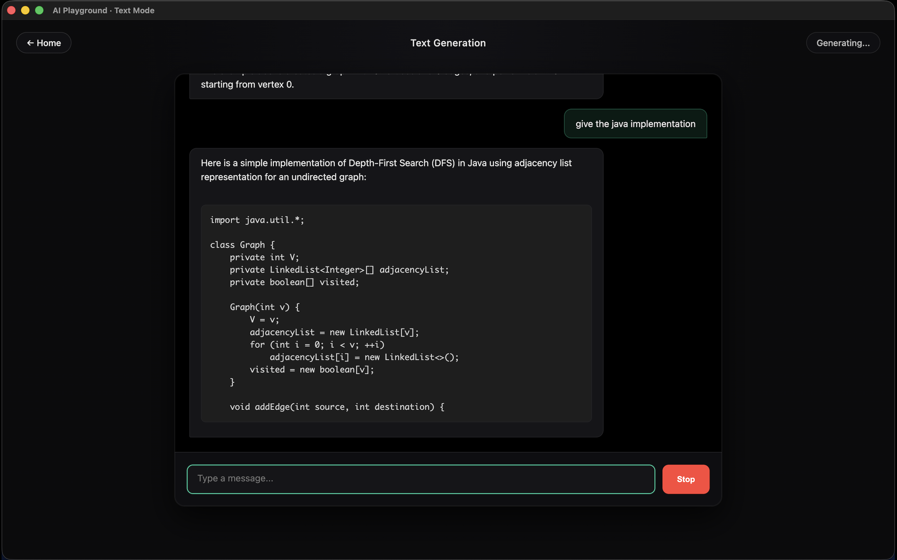
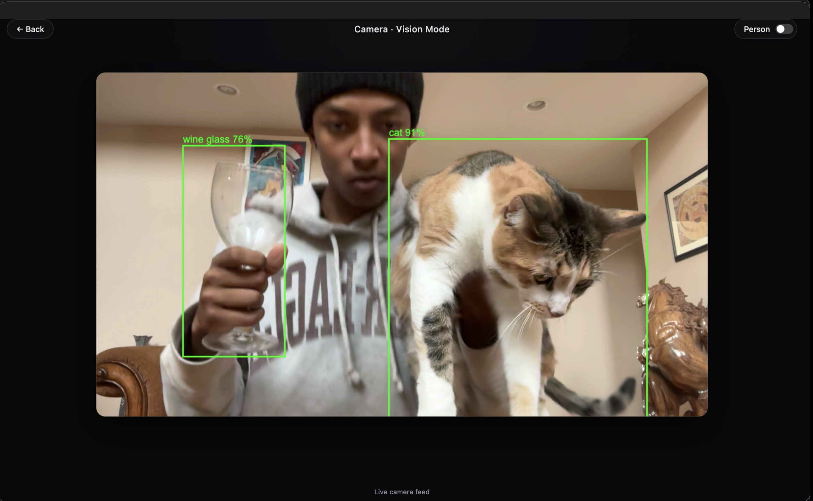

# AI Playground App

<p align="left">
  
  &nbsp;
  
</p>

## Overview
A high-performance, cross-platform Electron application designed for experimenting with local AI models. The app features a modular architecture that separates the UI thread from heavy AI inference tasks, ensuring a smooth camera preview even while running complex neural networks in the background.

The app supports AI integration in two distinct modes, maintaining a clean separation between raw data processing and the user interface.

---

##  Key Features

###  Video Mode (Computer Vision)
Real-time object detection powered by **TensorFlow.js**, running entirely locally on your machine.
* **Model:** SSD MobileNet V2 (trained on COCO Dataset - 90 Classes).

#### Performance Architecture
* **Off-Main-Thread Inference:** Heavy AI processing runs in a dedicated Electron Utility Process (Worker). This prevents the main application window from freezing or stuttering during inference.
* **Smart Downscaling:** High-res (1080p) video is displayed to the user, while a downscaled (640px) buffer is sent to the AI worker to maximize speed without sacrificing visual quality.

#### Advanced Post-Processing
* **Non-Max Suppression (NMS):** The worker filters raw model output (1,900+ tensors) to remove overlapping boxes and noise before sending data back to the UI.
* **Client-Side Filtering:** Includes a responsive "Show Person" toggle to instantly filter out specific classes without needing to re-run the AI.

---

###  Text Generation Mode (LLM)
* **Architecture:** Renderer-Controlled WebGPU
* **Engine:** [Web-LLM](https://github.com/mlc-ai/web-llm) (MLC AI)
    
* Web-LLM is an open-source project developed by researchers from Carnegie Mellon University (CMU), led by Professor Tianqi Chen. Because it runs entirely using WebGPU, your data never leaves your device, ensuring complete privacy and security and without relying on external cloud servers.

#### How It Works
* The AI engine is initialized and controlled by the **Renderer Process** (window), but the heavy computational work is offloaded directly to your **GPU** via the **WebGPU API**.
* **Zero IPC Overhead:** Because the Renderer talks directly to the GPU, data does not need to pass through the Main Process (Node.js), resulting in extremely low latency token generation.

#### Key Features
**Private & Offline:** Runs entirely on your hardware. No data is sent to external clouds or APIs.
**Fast Interrupt (Stop Button):** Implements a "Soft Reset" architecture. Clicking Stop instantly halts generation, visually reverts the interrupted message, and releases GPU locks without requiring a full model reload.
**Context Management:** Maintains chat history in memory, allowing for seamless context restoration even after interrupting generation.

#### Model Support
* **Default:** Automatically downloads and caches `Mistral-7B-Instruct-v0.3-q4f16_1-MLC` (~4GB).
* **Custom:** Switch models by setting the `LLM_MODEL_ID` variable in your `.env` file (must be an MLC-compatible weights format).

---

## System Requirements & Model Selection

This application runs the AI entirely on your local hardware. Performance depends heavily on your GPU VRAM and System RAM.

###  Recommended (Default Model - Mistral 7B)
* **Best for:** General purpose reasoning, coding, and chat.
* **RAM:** 16GB System RAM strongly recommended.
* **GPU:** Dedicated NVIDIA/AMD GPU or Apple Silicon (M1/M2/M3) with **at least 6GB-8GB VRAM**.
* **Default ID:** `Mistral-7B-Instruct-v0.3-q4f16_1-MLC`

### Minimum Specs / Low-End Machines
* **Best for:** Older laptops, integrated graphics (Intel Iris/UHD), or machines with only 8GB RAM.
* **RAM:** 8GB System RAM minimum.
* **GPU:** Integrated graphics with shared memory.
* **Recommended ID:** `Llama-3.2-3B-Instruct-q4f16_1-MLC` (Significantly faster and lighter).

### Configuration
To change the model, add or edit the `LLM_MODEL_ID` in your `.env` file:

```env
# Default (Balanced)
LLM_MODEL_ID=Mistral-7B-Instruct-v0.3-q4f16_1-MLC

# For lower-end machines (Fast & Lightweight)
LLM_MODEL_ID=Llama-3.2-3B-Instruct-q4f16_1-MLC
```

##### Note: The first time you load a model, it will download several gigabytes of data to your local cache. Subsequent loads will be near-instant.

## Build from Source (Required)

Since this application is designed to be a private, local AI tool, you must build the executable for your specific operating system.
1. Prerequisites & Setup

    Before building, you need to install the dependencies and manually download the vision model (as it is too large for Git).

- Install Dependencies
```
npm install
```
- Download Vision Model

    Download the TensorFlow.js model: SSD MobileNet V2 on Kaggle.

    Extract the contents (`model.json` + `.bin` files) into the project folder: `models/image/`

2. Build Your App

    Run the build command to generate a standalone application for your OS.

```
npm run make
```
or
```
npm run build:mac
```

3. Locate Your App

    Once the build completes, your application will be ready in the out/ folder:

| Operating System | Output Format | Location |
| :--- | :--- | :--- |
| **Windows** | Setup `.exe` | `out/make/squirrel.windows/` |
| **macOS** | Application `.app` | `/out/AI Playground-darwin-arm64/` |
| **Linux** | `.deb` / `.rpm` | `out/make/deb/` |